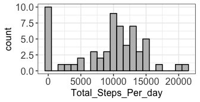
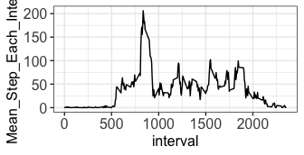
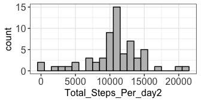
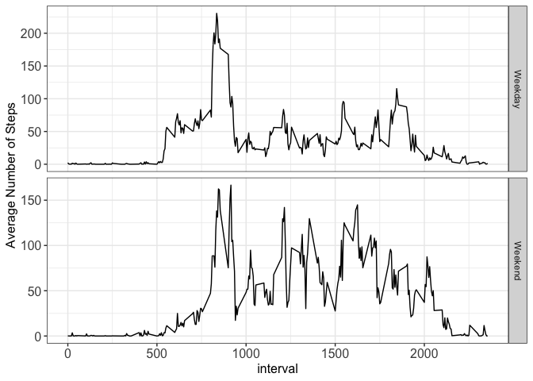

```r
## Loading and preprocessing the data
download.file("https://d396qusza40orc.cloudfront.net/repdata%2Fdata%2Factivity.zip", 
              destfile = "./assignment1data.zip")
unzip("./assignment1data.zip", exdir = "./Assignment1Data")
data <- read.csv("./Assignment1Data/activity.csv")
data$steps <- as.numeric(data$steps)
```


```r
## What is mean total number of steps taken per day?
summary_steps <- data %>% group_by(date) %>% 
      summarise(Total_Steps_Per_day=sum(steps, na.rm = TRUE))

th <- theme(axis.text=element_text(size=12), axis.title = element_text(size =12), legend.text = element_text(size =12), strip.text.x = element_text(size=12))

ggplot(summary_steps, aes(x=Total_Steps_Per_day)) + geom_histogram(binwidth = 1000, color="black", fill="grey") + theme_bw() + th
```

<!-- -->

```r
mean <- mean(summary_steps$Total_Steps_Per_day)
median <- median(summary_steps$Total_Steps_Per_day)
```

The mean total number of steps taken per day is 9354.2295082. The median total number of steps taken per day is 1.0395\times 10^{4}.


```r
## What is the average daily activity pattern?
summary_pattern <- data %>% group_by(interval) %>% 
      summarise(Mean_Step_Each_Interval = mean(steps, na.rm = TRUE))
ggplot(summary_pattern, aes(x=interval, y=Mean_Step_Each_Interval)) + theme_bw() + th + geom_line()
```

<!-- -->

```r
max_steps <- summary_pattern[which.max(summary_pattern$Mean_Step_Each_Interval),]
```

At 835 minute, on average across all the days, contains the maximum number of steps.


```r
## Imputing missing values
num_na <- colSums(is.na(data))

#Find NAs and fill in with the mean number of steps in that interval of all days
row_na <- as.data.frame(which(is.na(data$steps)))
colnames(row_na) <- "Row_Num"
data2 <- data
for(i in 1:nrow(row_na)) {
      subset <- data2 %>% filter(interval == interval[row_na$Row_Num[i]])
      data2$steps[row_na$Row_Num[i]] <- mean(subset$steps, na.rm = TRUE)
}

#plot histogram
summary_steps2 <- data2 %>% group_by(date) %>% 
      summarise(Total_Steps_Per_day2=sum(steps, na.rm = TRUE))

th <- theme(axis.text=element_text(size=12), axis.title = element_text(size =12), legend.text = element_text(size =12), strip.text.x = element_text(size=12))

ggplot(summary_steps2, aes(x=Total_Steps_Per_day2)) + geom_histogram(binwidth = 1000, color="black", fill="grey") + theme_bw() + th
```

<!-- -->

```r
mean2 <- mean(summary_steps2$Total_Steps_Per_day2)
median2 <- median(summary_steps2$Total_Steps_Per_day2)
```

The total number of missing values in the dataset is 2304.

Using the dataset with NA values filled in, the mean total number of steps taken per day is 1.0766189\times 10^{4}. The median total number of steps taken per day is 1.0766189\times 10^{4}. The total daily number of steps increased after filling in NA values.


```r
## Are there differences in activity patterns between weekdays and weekends?
data2$Day = weekdays(as.Date(data$date, "%Y-%m-%d"))
data2$Weekday_weekend = ifelse(data2$Day %in% c("Saturday", "Sunday"), "Weekend", "Weekday")
avg_step <- data2 %>% group_by(Weekday_weekend, interval) %>% 
      summarise(avg = mean(steps))
ggplot(avg_step, aes(x = interval, y = avg)) + geom_line() + theme_bw() + th + 
      facet_grid(Weekday_weekend~., scales = "free") + ylab("Average Number of Steps")
```

<!-- -->
